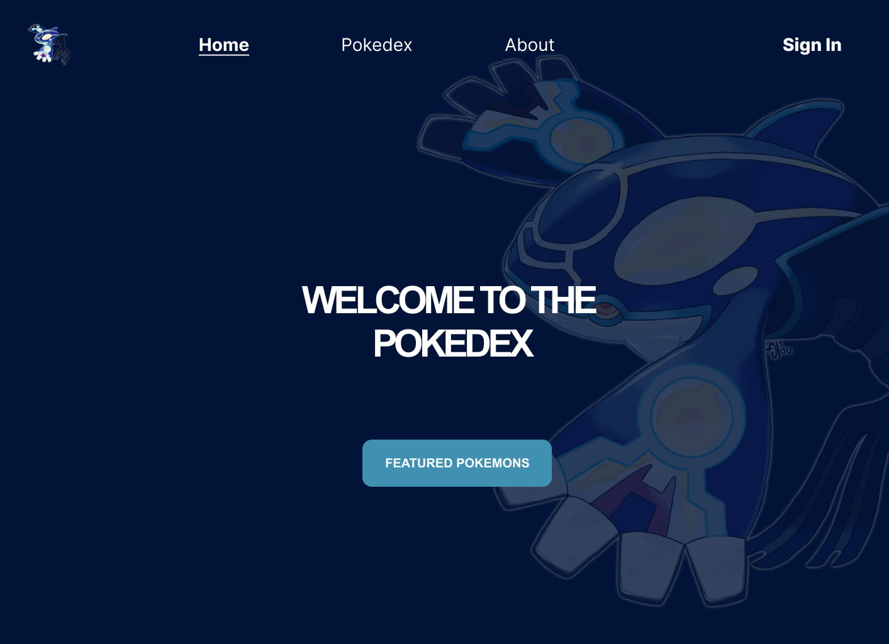

# Pokedex Project

Projet simple d'un Pokedex contenant les 151 premiers Pokemons.
Ce Jeu permettra aux utilisateurs de revoir les origines de Pokemon, 
en ayant accès à toutes les informations pour pouvoir se rappeler de bons souvenirs,
ou pour les nouveaux, de découvrir le monde des Pokemon.

Le jeu consistera, pour ceux qui le souhaite, à sélectionner 6 pokemons de leurs choix
et de les faire se battre contre d'autres utilisateurs ou bien des bots.

**Landing Page**



**Featured Pokemons**


**Redirection Section**


**Footer Section**


## How to run the projet 

### Backend

Cloner le repository avec :

```bash
git clone https://github.com/hauanitech/Pokedex.git
```

Télécharger les dépendences :

```bash
#if not done yet
cd backend

npm i
```

Lancer le Serveur

```sh
npm start
```

*N'oubliez pas de vous créer un fichier ```.env``` et de le remplir comme dans le ```.env.example```*

### Frontend

Aller dans le dossier frontend :

```bash
cd frontend
```

Installer les dépendances :

```bash
npm install
```

Créer un fichier `.env` basé sur `.env.example` :

```bash
# Windows
copy .env.example .env

# Linux/Mac
cp .env.example .env
```

Lancer le serveur de développement :

```bash
npm run dev
```

Le frontend sera accessible sur `http://localhost:5173`

### Stack Used

ExpressJS + MongoDB